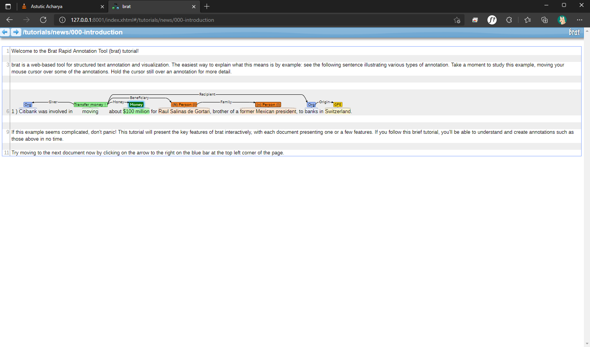
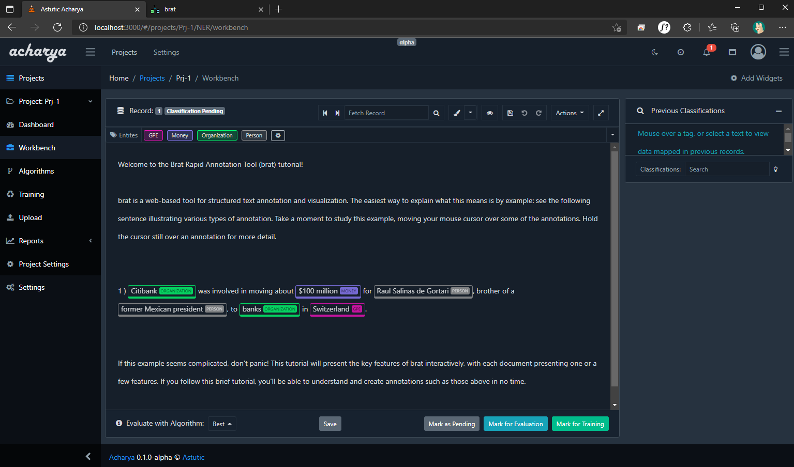

# Welcome to Brat-standoff to JSON converter

Brat-standoff to JSON converter is a cli tool that converts the given brat standoff to JSON format

## Using brat Standoff Converter

```bash
 git clone https://github.com/astutic/bratStandoffConverter.git
```

OR

Download a release from [here](https://github.com/astutic/bratStandoffConverter/releases)

Then run the file using go OR use the executable

## Examples

### Converts and Prints JSONL (in acharya format) for files in the specified directory

```bash
go run main.go -p "./path/to/the/collection"
```

OR

```bash
brat-standoff-to-json -p "./path/to/the/collection"
```

##### example

```bash
go run main.go -p "./testData/news"
```

OR

```bash
brat-standoff-to-json  -p "./testData/news"
```

### Save to an output file

```bash
go run main.go -p "./path/to/the/collection" --output "path/output-file-name"
```

OR

```bash
brat-standoff-to-json  -p "./path/to/the/collection" --output "path/output-file-name"
```

##### example

> The command below will generate an output file named **acharyaFormat.jsonl** in the current directory

```bash
go run main.go -p "./testData/news" --output "./acharyaFormat.jsonl"
```

OR

```bash
brat-standoff-to-json  -p "./testData/news" --output "./acharyaFormat.jsonl"
```

### Generating for specific files

! **NOTE** the order of the .ann files an .txt files should be the same  
`go run main.go --ann "file1.ann,file2.ann" --text "file1.txt,file2.txt" --conf "file.conf"`

##### example

```bash
go run main.go --ann "path/to/first.ann,path/to/second.ann" --text "path/to/first.txt,path/to/second.txt" --conf "path/to/annotation.conf"
```

OR

```bash
brat-standoff-to-json  --ann "path/to/first.ann,path/to/second.ann" --text "path/to/first.txt,path/to/second.txt" --conf "path/to/annotation.conf"
```

## Commands

| Command    | Short hand | Type   | Description                                                               | Default value |
| ---------- | ---------- | ------ | ------------------------------------------------------------------------- | ------------- |
| folderPath | p          | string | Path to the folder containing the brat standoff collection                |
| ann        | a          | string | Comma sepeartad locations of the annotation files (.ann) in correct order |
| txt        | t          | string | Comma sepeartad locations of the text files (.txt) in correct order       |
| conf       | c          | string | Location of the annotation configuration file (annotation.conf)           |
| output     | o          | string | Name of the output file to be generated                                   |
| force      | f          | bool   | If you wish to overwrite the generated file then set force to true        | false         |
| version    | v          | bool   | Prints the version number                                                 | false         |

## Original data displayed in brat



## Data from Brat converted to and uploaded to [Acharya](https://acharya.astutic.com)



## Note

**[ Windows PowerShell ]**
If you want to use the Brat → JSONL converter and If Brat Standoff **contains non English characters** Then its advised to set the following in PowerShell first

```powershell
$OutputEncoding = [console]::InputEncoding = [console]::OutputEncoding = New-Object System.Text.UTF8Encoding
```

#### Features that are currently unsupported:

- [Discontinuous text-bound annotations](https://brat.nlplab.org/standoff.html "https://brat.nlplab.org/standoff.html")
- [Advanced entity configuration](https://brat.nlplab.org/configuration.html#tool-configuration "https://brat.nlplab.org/configuration.html#tool-configuration")
